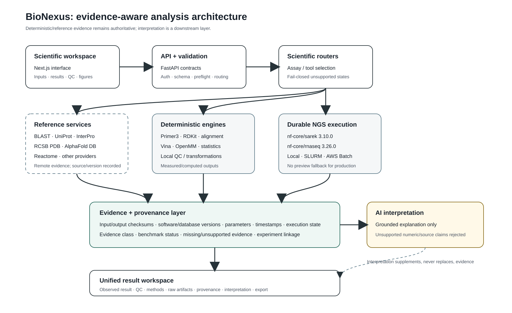
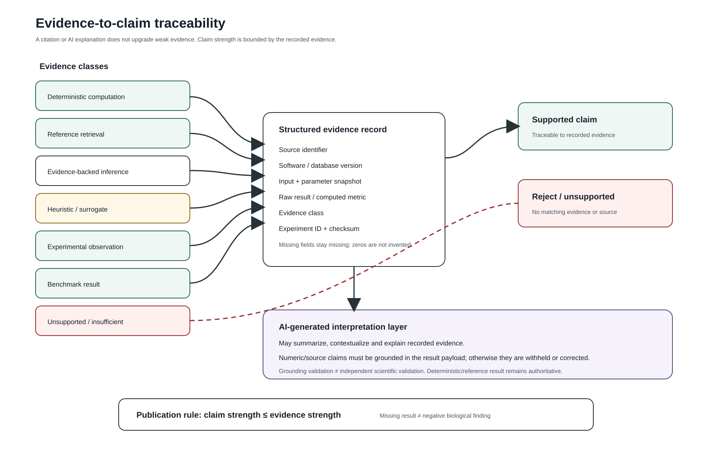
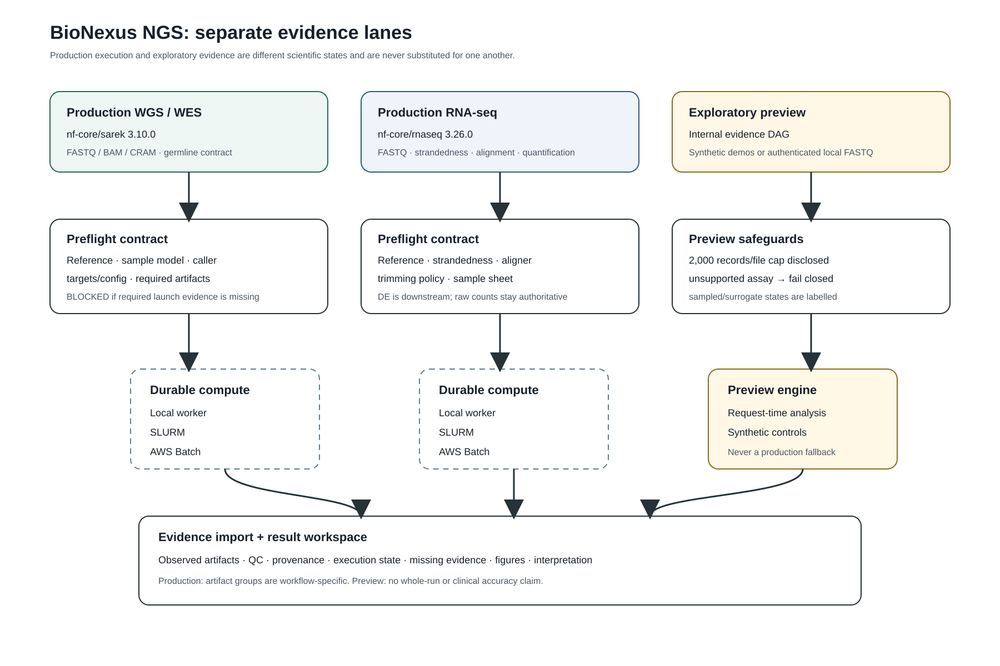
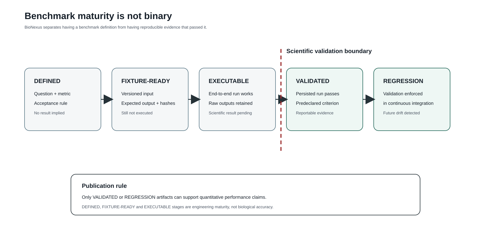
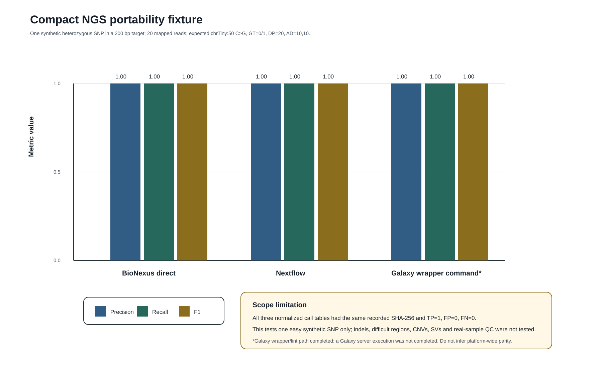

# BioNexus: an evidence-aware web workspace for reproducible multi-domain bioinformatics analysis with explicit provenance and scientific claim boundaries

**Working manuscript — research snapshot 2026-09-12**

**Authors:** Samad Saifi; *additional authors/affiliations to be inserted only with their approval*  
**Correspondence:** *to be completed before submission*  
**Software repository:** https://github.com/Samadsaifi14/bio-nexus-  
**Web application:** https://bio-nexus-ebon.vercel.app/

## Abstract

### Background

Modern bioinformatics increasingly requires investigators to move between sequence similarity searches, curated protein annotation, multiple-sequence alignment, phylogenetic inference, structural databases, molecular modelling, next-generation sequencing (NGS), statistical analysis and AI-assisted interpretation. Mature platforms such as Galaxy improve accessibility and reproducibility for broad classes of analyses, while workflow systems such as Nextflow and community-curated nf-core pipelines provide portable, versioned execution across local, high-performance-computing (HPC) and cloud infrastructure [1–3]. A persistent challenge, however, is not merely running tools but preserving a transparent boundary between directly measured results, external reference retrieval, heuristic or surrogate evidence, benchmark outcomes and generated interpretation.

### Methods

We developed BioNexus as a web-based bioinformatics orchestration and evidence workspace. The application uses a Next.js frontend and FastAPI backend with structured result contracts, provenance records, benchmark definitions and evidence classes. Scientific functions include sequence similarity search, protein/reference retrieval, multiple-sequence alignment, phylogeny, domain/motif analysis, primer design, structural retrieval and analysis, molecular docking, molecular-dynamics (MD) workflows, physicochemical descriptor calculation and NGS orchestration. Production WGS/WES execution is pinned to `nf-core/sarek` 3.10.0, and production RNA-seq execution is pinned to `nf-core/rnaseq` 3.26.0. These workflows can be submitted to configured local, SLURM or AWS Batch executors. An exploratory NGS preview is retained as a separate evidence class and cannot substitute for production execution. AI-generated explanation is downstream of deterministic/reference evidence and is subject to grounding checks.

### Results

A publication-focused code audit identified and corrected several discrepancies that could have weakened reproducibility claims: unsigned JWT claims were being used to derive rate-limit identity; server-local NGS inputs were insufficiently sandboxed; unknown NGS assays could silently default to WGS; the frontend described production NGS as plan-only despite implemented durable executors; and RNA-seq runs could be persisted with an incorrect Sarek workflow identity and evaluated using DNA-variant artifact requirements. These paths were hardened to fail closed and to preserve workflow-specific provenance. A compact synthetic NGS portability fixture containing one heterozygous SNP produced identical normalized call tables in the recorded BioNexus direct and Nextflow executions; a Galaxy wrapper command produced the same normalized table, although a Galaxy server execution was not completed. For this deliberately narrow fixture, TP=1, FP=0 and FN=0 (precision=recall=F1=1.0). This result demonstrates deterministic portability of one controlled workflow output and does not establish real-sample accuracy or platform-wide equivalence.

### Conclusions

BioNexus is best characterized as an evidence-aware orchestration and interpretation workspace rather than a replacement for established scientific engines. Its principal design contribution is the explicit coupling of execution state, provenance, evidence class, benchmark maturity and claim boundaries in a unified result interface. Full claims of NGS biological accuracy or comparative superiority require matched external benchmarks, including GIAB-based genomics evaluation and retained multi-replicate RNA-seq validation, and are therefore intentionally excluded from the present manuscript.

**Keywords:** bioinformatics; reproducibility; provenance; evidence; NGS; RNA-seq; Nextflow; nf-core; Galaxy; scientific software; AI grounding

---

## 1. Introduction

Bioinformatics analysis is rarely a single-tool activity. A researcher may begin with an uncharacterized sequence, perform a similarity search, inspect curated annotations and domains, retrieve or compare structures, design primers, test molecular interactions, analyze sequencing data, and finally integrate the resulting evidence into a biological interpretation. The individual tools for many of these tasks are mature. The practical difficulty lies in connecting them without obscuring their different assumptions, evidence types, versions and failure modes.

Galaxy has demonstrated the value of making computational biology accessible through a browser while preserving workflows, histories and sharable analyses [1]. Nextflow addresses a complementary problem: portable orchestration of computational workflows across heterogeneous infrastructure [2]. The nf-core community has built on this model by distributing community-curated, tested pipelines with standardized conventions [3]. These systems establish an important baseline: a new bioinformatics platform should not claim scientific novelty merely because it wraps existing algorithms in a web interface.

BioNexus was therefore developed around a different primary question: **how can heterogeneous scientific results be presented in one workspace without erasing the boundary between what was measured, what was retrieved, what was inferred, what was benchmarked and what was generated as explanation?** The system integrates specialist engines and databases, but the deterministic or externally retrieved result remains authoritative. AI-generated text is treated as interpretation, not as an alternative source of truth.

This distinction is particularly important for NGS. Sequencing workflows combine data integrity checks, read quality assessment, preprocessing, alignment or pseudoalignment, sample-level quality control, statistical modelling, variant calling or expression quantification, annotation, and multiple forms of provenance. For WGS/WES, `nf-core/sarek` provides a portable variant-analysis workflow that can run across multiple compute infrastructures [4]. For RNA-seq, nf-core/rnaseq provides versioned alignment, quantification and QC options, while downstream differential-expression methods such as DESeq2 depend on appropriate count data, replicate structure and model design [3,5,6]. MultiQC provides a project-level aggregation layer that helps expose outlier samples and systematic biases [7]. These established workflows and statistical methods are preferable to silently reimplementing complex production pipelines in application-specific code.

A second challenge is validation. Scientific software often contains tests, but not every test is a scientific benchmark. A schema unit test can establish that an API returns a finite number; it cannot establish biological accuracy. A synthetic fixture can prove deterministic behavior on a known input; it cannot establish performance across difficult human genomic regions. The GA4GH/GIAB benchmarking framework illustrates why this distinction matters for variant calling: evaluation requires matched truth sets, confident regions, well-defined metrics and stratification by variant class and genome context [8]. BioNexus therefore uses an explicit benchmark maturity model that separates definition, fixture readiness, executability, validation and continuous-regression status.

Here we describe the BioNexus architecture, scientific evidence model, corrected NGS execution design and publication-validation framework. We also report the results of a repository-wide publication-focused audit and a deliberately narrow NGS portability fixture. The manuscript avoids claims of platform-wide superiority; instead, it documents what the current implementation can support, what remains unevaluated and how future comparisons must be performed.

---

## 2. Materials and Methods

### 2.1 Software architecture

BioNexus is organized as a browser-based scientific workspace backed by typed API contracts and modular scientific services (Figure I). The frontend is implemented with Next.js and TypeScript. The backend is implemented with FastAPI/Python and exposes scientific routers for sequence, annotation, structural, molecular-modelling, statistics, NGS, evidence, benchmark and publication-related functions. Supabase is used for authentication and durable application data; Redis-backed services are available for caching/queue-related functions where configured.

The architecture deliberately separates five layers:

1. **Scientific workspace:** input forms, result views, QC summaries, figures and raw-artifact access.
2. **API and validation:** authentication, request schemas, preflight checks and scientific routing.
3. **Scientific engines:** deterministic local computation, external reference services and durable production workflows.
4. **Evidence and provenance:** source identifiers, versions, parameters, checksums, execution states and evidence classes.
5. **Interpretation:** grounded AI-generated explanation applied only after scientific results exist.

**Figure I.** BioNexus evidence-aware architecture. Reference retrieval, deterministic computation and durable workflow execution feed an evidence/provenance layer before results are rendered. AI interpretation is downstream and cannot replace the scientific result.

### 2.2 Evidence classification and claim policy

Each reportable statement is intended to be classifiable as one of the following: deterministic computation, reference retrieval, evidence-backed inference, heuristic/surrogate, AI-generated interpretation, experimental observation, benchmark result, or unsupported/insufficient evidence. This vocabulary is used to prevent a common failure mode in scientific interfaces: presenting values with similar visual weight even though their epistemic status is different.

The central policy is:

> **claim strength must not exceed evidence strength.**

For example, a value returned by a remote curated database can support a reference-retrieval claim if the source identifier and retrieval metadata are recorded. A heuristic estimate can be shown, but must not be visually or semantically promoted to an experimental observation. An AI explanation may summarize a reported metric, but a citation or fluent explanation does not convert an unsupported biological statement into validated evidence.

**Figure III.** Evidence-to-claim traceability. Unsupported claims are rejected rather than “completed” by AI. Grounding validation checks correspondence to recorded evidence; it is not independent scientific validation.

### 2.3 Sequence and annotation services

BioNexus integrates sequence-oriented services through adapters that normalize provider responses into structured results. BLAST-style similarity search uses provider adapters and records program/database parameters and returned hit statistics. Protein annotation and identifier-oriented workflows integrate UniProtKB, a curated and computationally annotated protein knowledgebase [9]. Domain and family evidence is connected to InterPro/PROSITE-oriented functions; InterPro integrates predictive signatures from multiple member databases for protein families, domains and functional sites [10].

Multiple-sequence alignment and phylogeny are treated as explicit computational stages rather than hidden transformations. Where a provider fallback uses a different algorithmic implementation, the method identity must remain visible; a fallback is an availability strategy, not evidence that two algorithms are scientifically interchangeable.

Pathway-oriented results can use Reactome, a curated pathway knowledgebase, as an external reference source [11]. External database results remain retrieval evidence unless additional statistical or experimental support is present.

### 2.4 Primer design

Primer design is based on Primer3-compatible functionality with explicit sequence, melting-temperature, GC and secondary-structure-related summaries. Primer3 provides established thermodynamic and primer-placement capabilities and has been widely integrated into molecular-biology software [12]. BioNexus exposes candidate information and QC as design evidence; it does not claim that computationally acceptable primers are experimentally validated PCR assays.

### 2.5 Structure retrieval and structural analysis

BioNexus distinguishes experimentally determined structures from computed/predicted models. RCSB PDB is used as a primary structural reference source for deposited macromolecular structures and related computed-model access [13]. AlphaFold DB is treated as a **retrieval source for predicted structures**, not as an engine that BioNexus itself runs to predict structures; the database provides broad coverage of protein-sequence space with model-confidence information [14]. This distinction is preserved in product language and provenance.

Structural analysis outputs may include geometry-derived measurements and visualizations. Any derived measure is tied to the specific input structure/model. A retrieved predicted structure therefore does not acquire experimental status merely because downstream deterministic calculations were performed on it.

### 2.6 Molecular docking

The docking path uses AutoDock Vina when the configured backend successfully executes it. AutoDock Vina is a widely used open-source molecular docking engine; Vina 1.2 extended force-field and docking capabilities and provides scripting interfaces [15]. BioNexus records docking poses, affinity-related scores, configuration and log information where available.

Docking score and pose accuracy are treated as separate concepts. A favorable Vina score is not itself validation that the crystallographic pose has been recovered. The BioNexus benchmark protocol therefore specifies a redocking path using symmetry-aware RMSD against a crystallographic ligand pose. At the audited snapshot, the recorded 1IEP benchmark path contained a ligand-SDF sanitization failure before RMSD evaluation; consequently, redocking accuracy is not claimed in this manuscript.

### 2.7 Molecular dynamics

The hosted MD workflow is scoped to OpenMM-based computation. OpenMM is a high-performance, extensible molecular-simulation toolkit [16]. The current BioNexus hosted workflow is explicitly described as **implicit-solvent OpenMM**, with the conceptual sequence:

`system preparation → minimization → equilibration → production trajectory`.

Outputs such as RMSD, RMSF, radius of gyration, SASA, PCA or correlation analyses are meaningful only if the corresponding trajectory was actually produced and the analysis method is recorded. A fallback or missing OpenMM dependency must not be presented as an equivalent production MD result. No claim of explicit-solvent equivalence is made.

### 2.8 Physicochemical descriptor / ADMET-related functions

RDKit-backed calculations provide deterministic molecular descriptors and structure-processing utilities where configured. These values are useful physicochemical evidence. The manuscript deliberately avoids describing generic descriptors as clinically validated pharmacokinetic or toxicological predictions unless a separately validated predictive model and benchmark are present.

### 2.9 NGS architecture

The NGS workspace was redesigned around three scientifically distinct execution lanes (Figure II).

**Figure II.** Corrected NGS architecture. Production WGS/WES and production RNA-seq use pinned nf-core workflows and durable compute when configured. The exploratory evidence preview is isolated and cannot substitute for production execution.

#### 2.9.1 Production WGS/WES

Human WGS/WES production planning is pinned to `nf-core/sarek` 3.10.0 [4]. Sarek is a Nextflow workflow for preprocessing, variant calling and annotation across whole-genome and targeted sequencing, and the current nf-core release uses portable process/container execution [4]. BioNexus accepts a structured production request and returns a non-shell argument vector, workflow identity/revision, blockers, warnings, required artifact groups and provenance requirements.

Supported orchestration adapters are:

- local durable execution;
- SLURM submission/status tracking; and
- AWS Batch submission/status tracking.

An executor must be explicitly enabled and satisfy its runtime requirements. If production compute is unavailable, submission fails; the system does not silently run the exploratory preview.

For clinical-intent configurations, the software evidence gate is intentionally stricter. It requires, among other fields, a completed pinned workflow, sample/reference provenance, required artifacts, identity and contamination evidence, external truth benchmarking, review and release metadata. Even a complete software evidence package returns a software-gate status rather than “clinically validated,” because clinical validation additionally requires laboratory, regulatory and jurisdiction-specific processes outside the application.

#### 2.9.2 Production RNA-seq

Production transcriptomics is pinned to `nf-core/rnaseq` 3.26.0. The nf-core/rnaseq pipeline supports STAR, RSEM, HISAT2 and Salmon-oriented workflows with gene/isoform counts and extensive QC [3]. BioNexus exposes the workflow as a separate production lane with explicit reference, strandedness, alignment/quantification strategy, trimming policy, compute profile, launch contract and observed artifact inventory.

RNA-seq provenance is workflow-specific. The executor persists `nf-core/rnaseq` and its revision rather than reusing WGS/WES metadata. Expected artifact groups include execution metadata, FastQC/MultiQC-type QC, alignments when produced, quantification outputs, expression-QC artifacts and provenance. DNA variant files are not required for a base RNA-seq run.

Downstream differential expression is treated as a separate statistical stage. DESeq2 models RNA-seq count data using shrinkage-based estimation of dispersions and fold changes and is designed for replicated count-based comparisons [6]. Therefore, raw integer counts—not TPM values—are the inferential input for DESeq2-style testing. Sample-level QC, experimental design, contrasts and potential confounding/batch factors must be recorded before differential-expression claims are produced. Multiple-testing correction is mandatory for reportable DEG significance. PCA/sample-distance views, MA plots, volcano plots and heatmaps are secondary views of a defined analysis, not substitutes for the model.

#### 2.9.3 Exploratory NGS evidence preview

The exploratory path remains available for deterministic synthetic demonstrations and authenticated server-local FASTQ inspection. It is intentionally limited:

- server-local input paths must resolve below a configured `NGS_INPUT_ROOT`;
- arbitrary filesystem paths are rejected;
- remote URL ingestion is rejected instead of being accepted without actual analysis;
- unknown assays do not silently default to WGS;
- unsupported targeted/amplicon analysis fails closed;
- a 2,000-record-per-file cap is disclosed;
- truncated files are labelled `SAMPLED_PREVIEW`; and
- missing evidence remains `NOT_EVALUATED` rather than being converted to zero.

This path is suitable for UI validation, deterministic functional controls and teaching. It is not a substitute for full-scale production analysis.

### 2.10 Data movement and compute placement

Large sequencing datasets should not be designed around synchronous browser upload and request lifetimes. Real-world Galaxy support discussions show that tens to hundreds of gigabytes of FASTQ data can become a dominant usability constraint and that server-to-server/cloud transfer is often preferable. BioNexus production contracts therefore assume staged data in an authorized environment rather than embedding a giant browser upload into the scientific workflow.

Compute is similarly separated from the web request. Nextflow is designed for portable workflow execution across computational environments [2], and nf-core standardizes reusable pipelines on top of it [3]. BioNexus treats the browser as a control/evidence plane and durable local/HPC/cloud infrastructure as the production execution plane.

### 2.11 Execution-state semantics

Production NGS runs use explicit states: `SUBMITTED`, `PENDING`, `RUNNING`, `SUCCEEDED`, `FAILED`, and `UNKNOWN`. This distinction addresses a practical source of user confusion in shared infrastructures, where queued work may be mistaken for active compute. Executor job IDs and output locations remain available to the authenticated owner.

### 2.12 Provenance and reproducibility

The intended provenance record includes input/output checksums, source identifiers, workflow/tool versions, parameters, timestamps, execution status and evidence class. The production NGS executor additionally stores a SHA-256 digest of the launch argument vector. The benchmark repository defines required fixture fields and required run fields, including git commit, container digest, operating system, hardware, software/database versions, parameters, seed where applicable, metrics, sample size, confidence interval/effect size where applicable, pass/fail and failure reason.

This design follows the broader reproducibility rationale underlying Nextflow/nf-core [2,3] and the FAIR principle that reusable research objects require sufficient metadata to be discoverable, accessible under defined procedures, interoperable and reusable [17].

### 2.13 AI interpretation and grounding

AI-generated explanation is applied only after deterministic/reference outputs exist. The interpretation layer is allowed to summarize and contextualize recorded evidence. Numeric or source claims are checked against the result context; unsupported claims can be withheld or corrected. This mechanism is best interpreted as **grounding validation**. It does not establish biological correctness independently of the underlying scientific result.

The deterministic result remains authoritative. Missing evidence is not interpreted as a negative biological finding.

### 2.14 Security hardening relevant to scientific integrity

The publication audit included security issues that could affect reproducibility, confidentiality or trust in analysis ownership.

First, the previous rate-limit identity function decoded JWT payload claims without verifying the signature. Because an unverified `sub` could be forged, the limiter was changed to use network-source identity until a verified-principal middleware is introduced.

Second, server-local exploratory NGS paths were sandboxed beneath `NGS_INPUT_ROOT` and require authentication. Parse errors no longer return user-supplied absolute paths.

Third, public health diagnostics were minimized to liveness/version rather than exposing queue and runtime/platform details. Continuous paper-generation background work was changed from default-on to explicit opt-in. CORS configuration was consolidated into exact trusted origins.

These changes are not biological-validation results, but they reduce ambiguity between authenticated analysis ownership and unauthenticated platform behavior.

### 2.15 Benchmark maturity model

BioNexus uses five benchmark maturity states (Figure V):

1. `DEFINED`: metric/question and acceptance rule exist;
2. `FIXTURE-READY`: versioned input/expected output and checksums exist;
3. `EXECUTABLE`: BioNexus can run the benchmark end-to-end;
4. `VALIDATED`: a persisted run passed the predeclared criterion; and
5. `REGRESSION`: the validated benchmark is enforced in continuous integration.

**Figure V.** Benchmark maturity ladder. The scientific-validation boundary lies between executability and validated evidence. A benchmark definition or successful execution alone is not a performance result.

### 2.16 Compact NGS portability fixture

The repository contains a small synthetic positive-control benchmark designed to test workflow-output portability without requiring large downloads. The fixture contains 20 mapped reads across a 200-bp synthetic target and one declared heterozygous SNP at `chrTiny:50 C>G` with genotype `0/1`, depth 20 and allelic depth `10,10`.

The recorded toolchain uses samtools/bcftools 1.24 and a filtering rule of `QUAL>=20 && FORMAT/DP>=10`. Normalized output tables were compared by SHA-256 and against the known synthetic call. The fixture includes recorded BioNexus direct and Nextflow executions. A Galaxy wrapper command produced the same normalized table and wrapper lint passed, but a Galaxy server bootstrap/execution was not completed; therefore the Galaxy item is explicitly not treated as a completed platform-level benchmark.

### 2.17 Planned full NGS validation

A full WGS/WES accuracy comparison must use a recognized truth dataset such as GIAB HG002 with matched reference build and confident regions. GIAB provides benchmark variant calls and benchmark regions, and GA4GH best practices recommend standardized comparison, performance metrics and stratification by genome context [8]. The planned comparison will run the same input/reference/regions through BioNexus production Sarek execution and an independent Sarek reference run, with a defined Galaxy workflow where tool/parameter equivalence is defensible. Each callset will be evaluated independently against the truth set.

Required outputs include SNV and indel TP/FP/FN, precision, recall and F1; genotype concordance/no-call counts; difficult-region stratification; callable/benchmark denominators; mapping/coverage/duplication/insert-size/contamination/identity QC; runtime/resources; and complete software/reference/container provenance.

### 2.18 Planned RNA-seq validation

RNA-seq validation will use a public, multi-replicate dataset with declared experimental design, fixed reference FASTA/GTF release and retained raw counts. Base-processing comparison will include per-sample FastQC/MultiQC evidence, trimming retention, mapping/assignment or pseudoalignment metrics, strandedness evidence and count-table concordance where equivalent definitions exist. Downstream DESeq2 analysis will retain the design formula, contrasts, normalization/dispersion outputs, PCA/sample distances, MA/volcano/heatmap figures, log2 fold changes, adjusted p-values and stated thresholds.

---

## 3. Results

### 3.1 Audit-driven correction of scientific state boundaries

The code audit identified a recurring class of defect: the backend often contained stronger or more nuanced capability than the UI or provenance model communicated. Correcting these inconsistencies was necessary before writing performance-oriented manuscript claims.

The most important examples were NGS-related. Production execution adapters for local, SLURM and AWS Batch already existed, but the WGS/WES UI stated that BioNexus did not submit jobs. Conversely, the exploratory preview could accept an unknown assay and fall back to WGS, which created the opposite error: presenting an analysis path with more confidence than the scientific routing evidence justified. The revised interface now begins with an execution-lane choice and derives executor readiness from backend capability.

RNA-seq exposed a provenance-level error. The correct `nf-core/rnaseq` command could be generated, yet the shared executor persisted a default `nf-core/sarek 3.10.0` identity. The artifact importer likewise used DNA-variant artifact groups for every workflow. These issues were corrected by making workflow name/revision explicit execution provenance and by selecting artifact contracts according to workflow identity.

### 3.2 Compact synthetic NGS portability result

All three recorded normalized call tables in the compact portability fixture have SHA-256:

`cefef322e336202da82549c1d5c09cf546a70b4aacfe9d1cc7e090a8aa23bbb1`.

For the single expected heterozygous SNP, the recorded results are:

| Path | Execution status | TP | FP | FN | Precision | Recall | F1 |
|---|---|---:|---:|---:|---:|---:|---:|
| BioNexus direct | EXECUTED | 1 | 0 | 0 | 1.0 | 1.0 | 1.0 |
| Nextflow | EXECUTED | 1 | 0 | 0 | 1.0 | 1.0 | 1.0 |
| Galaxy wrapper command | EXECUTED_WITHOUT_GALAXY_SERVER | 1 | 0 | 0 | 1.0 | 1.0 | 1.0 |

**Figure IV.** Compact synthetic portability result. The graph intentionally repeats the scope limitation: one easy synthetic SNP cannot establish real-sample variant-calling accuracy, indel/SV/CNV performance or platform-wide equivalence. The Galaxy wrapper item is not a completed Galaxy server run.

The correct interpretation of this result is therefore narrow: **the recorded command/workflow paths produced the same normalized output for this controlled fixture.** It does not demonstrate that BioNexus is as accurate as Sarek or Galaxy for WGS/WES, and it does not establish clinical validity.

### 3.3 Explicit representation of missing and unevaluated evidence

The exploratory NGS result contract distinguishes missing/unevaluated evidence from numeric zero. For example, contamination or identity checks that were not performed are represented as not evaluated rather than as `0`, preventing a UI from implying “0% contamination” or “0 identity failures” when no such measurement exists. Sampled FASTQ analysis is likewise disclosed with a record cap and a list of truncated files.

This is a user-interface result as much as a backend result: scientific dashboards frequently compress state into a small number of cards, and the distinction between *zero*, *missing*, *not applicable* and *not evaluated* must survive that compression.

### 3.4 Production execution is capability-dependent and fail-closed

Production NGS capability is now derived from the configured executor. A local executor requires Nextflow, Java and a container runtime as well as an explicit enable flag. SLURM additionally requires scheduler commands/shared paths; AWS Batch requires configured region/queue/job-definition information and the client dependency. If requirements are missing, the executor is reported as unavailable and the submission endpoint fails rather than launching a preview.

The result state therefore has a stronger interpretation than before: `SUBMITTED` refers to a real production executor adapter, whereas exploratory runs remain in the preview evidence class.

### 3.5 CI now checks scientific execution boundaries

The repository contains a scientific-integrity workflow covering deterministic benchmark tests, NGS scientific contracts and staged MD tests. The publication-hardening branch additionally adds production NGS provenance/security tests to backend CI and adds a dedicated frontend lint/build workflow. These checks establish software-regression boundaries; they do not independently establish biological accuracy.

### 3.6 User-feedback-informed workflow design

Recent public Galaxy support threads highlight four recurring usability problems relevant to BioNexus design: very large FASTQ uploads, jobs that remain queued/scheduled long enough to be mistaken for failed execution, difficulty diagnosing whether a job has actually started, and the need to validate workflow state before expensive execution. A 2026 Galaxy development issue specifically argues for schema-aware workflow/tool-state validation before execution because errors otherwise surface after resource consumption.

BioNexus responds to these problems through staged-path production contracts, explicit executor states and preflight validation. This is a design rationale, not a comparative performance result: Galaxy remains a mature, widely deployed platform with substantially broader community infrastructure [1].

---

## 4. Discussion

### 4.1 The contribution is evidence architecture, not algorithm replacement

The strongest interpretation of BioNexus is not that it implements a new BLAST algorithm, a new RNA-seq aligner or a new variant caller. Instead, it creates a common evidence surface over specialist resources and workflows. This is scientifically useful only if the platform preserves the identity and limitations of those underlying methods.

For this reason, BioNexus deliberately names `nf-core/sarek` and `nf-core/rnaseq` as production workflows rather than describing their internal component tools as if BioNexus itself reimplemented them. Similarly, an AlphaFold DB result is described as a retrieved predicted structure [14], and a PDB entry remains an external structural reference [13]. This naming discipline is important for reproducibility and citation.

### 4.2 Relationship to Galaxy and Nextflow/nf-core

Galaxy and Nextflow solve overlapping but distinct problems. Galaxy provides a mature web platform, history model, workflow ecosystem, tool integration and large user/support community [1]. Nextflow provides portable computational orchestration [2], and nf-core adds community-standardized pipelines [3]. BioNexus should therefore interoperate conceptually with these systems rather than frame them as obsolete competitors.

The corrected BioNexus production NGS design uses nf-core workflows as authoritative production engines. The application adds preflight contracts, capability reporting, evidence/provenance integration and a unified result/interpretation workspace. Whether this produces lower manual burden or better output accessibility than Galaxy is an empirical question for the comparative evaluation protocol, not a statement to be assumed in advance.

### 4.3 Why the exploratory NGS path is retained

It could be argued that a custom preview pipeline should be deleted once production nf-core execution exists. We retain it for a narrower purpose: rapid deterministic demonstrations, UI testing, educational inspection and controlled functional fixtures. The scientific risk is not its existence but its presentation. If a preview is visually indistinguishable from a full production run, users can easily overinterpret it. The three-lane architecture resolves this by making the execution/evidence boundary visible before a run begins.

### 4.4 RNA-seq requires experimental-design evidence

RNA-seq is especially vulnerable to “pipeline completeness” being confused with inferential validity. A technically correct alignment/counting pipeline cannot rescue an unreplicated or confounded experiment. DESeq2 explicitly addresses count-data variability and replicate-level dispersion [6], and project-level QC tools such as MultiQC help detect sample anomalies [7]. BioNexus therefore treats design metadata, contrasts, replication and batch/confounder variables as part of the scientific contract, not optional annotation.

This also affects visualization. Volcano plots and heatmaps are useful summaries but can create false confidence if detached from a specified contrast, normalization strategy and multiple-testing correction. BioNexus should render these figures only from recorded statistical outputs and keep the thresholds/design accessible in the same result workspace.

### 4.5 Security is part of reproducibility

Scientific reproducibility is usually discussed in terms of versions, inputs and parameters, but authorization and data isolation also matter. A workflow record is not trustworthy if ownership can be spoofed or if one user can inspect another user's staged data. The NGS path sandbox and verified-auth requirement therefore support both confidentiality and provenance integrity.

The rate-limiter issue illustrates a broader principle: decoding a token is not equivalent to verifying it. Although the affected code controlled quotas rather than scientific results directly, accepting unsigned identity claims would undermine attribution and abuse controls. Until a verified-principal rate-limit middleware exists, network-source limiting is the safer conservative behavior.

### 4.6 Interpretable AI requires a deterministic anchor

Scientific AI features are most defensible when their role is narrow and testable. In BioNexus, AI is an explanation layer over evidence already produced by deterministic computation or external references. Numeric claims are checked against the result payload, and unsupported claims may be rejected. This reduces a class of hallucination but does not prove that every biological interpretation is correct.

Future AI evaluation should therefore report at least numeric fidelity, citation/source fidelity, unsupported-claim rate and expert-reviewed biological correctness on a fixed test set. Grounding success should never be renamed “scientific validation.”

### 4.7 Benchmarking must remain predeclared

The repository's BBS-1/BBS-2 protocols are designed to reduce retrospective metric selection. This is important because a broad platform exposes many possible metrics, creating a high risk of selectively reporting only successful examples. A benchmark becomes manuscript evidence only after the dataset, versions, raw outputs and acceptance rule have been retained.

The maturity ladder makes this operational. `EXECUTABLE` is an engineering achievement; `VALIDATED` is a scientific evidence state. Moving that boundary backward would inflate claims without adding data.

---

## 5. Limitations

The present manuscript has several important limitations.

First, the compact NGS fixture is intentionally tiny. It contains one easy synthetic heterozygous SNP and cannot evaluate difficult-to-map regions, indels, structural variants, copy-number variants, contamination, sample identity or realistic coverage distributions. A GIAB/GA4GH-aligned benchmark remains necessary [8].

Second, several external-provider adapters are primarily covered by mocked/offline tests. These tests are useful for request/response contracts and failure handling but do not establish that live external services will return identical content over time. Database release/retrieval metadata and retained raw responses are required for longitudinal validation.

Third, the current docking redocking benchmark has an unresolved ligand SDF sanitization failure before RMSD in the recorded 1IEP path. Docking execution functionality must therefore be separated from validated pose-recovery performance.

Fourth, the hosted MD scope is implicit-solvent OpenMM. The platform does not currently establish equivalence to explicit-solvent production protocols or long-timescale simulation studies.

Fifth, RNA-seq production execution is present, but a retained multi-sample benchmark connecting workflow outputs to a fully documented differential-expression design has not yet been reported in this manuscript.

Sixth, the production execution adapters are capability-dependent. Source-code support for local, SLURM or AWS Batch does not imply that every hosted deployment has those executors enabled or provisioned.

Finally, BioNexus is a rapidly evolving research software project. Before journal submission, the accepted software snapshot should be tagged, archived in an immutable DOI-minting repository, and all manuscript figures/tables should be regenerated from that tagged snapshot.

---

## 6. Future validation and comparative evaluation

The next evaluation phase should use identical scientific workloads across BioNexus, an independently invoked reference workflow and Galaxy where meaningful equivalence can be achieved. The comparison should report:

- workflow completion and explicit failure state;
- result concordance at matched scientific stages;
- reproducibility across reruns;
- provenance completeness;
- error transparency;
- manual transitions/interventions;
- output accessibility; and
- compute/runtime/resource metrics where environments permit fair measurement.

The study must not imply a single “winner” from heterogeneous metrics. A platform could reduce manual transitions while producing the same scientific output; another could provide richer provenance; another could be faster because of infrastructure rather than software design. Results should therefore be metric-specific and accompanied by environment descriptions.

For WGS/WES, GIAB benchmarking should be completed before any accuracy comparison is published. For RNA-seq, the next priority is a multi-replicate, public dataset with predeclared design and DESeq2 contrasts. For docking, a clean redocking fixture set should be retained with reference poses and symmetry-aware RMSD. For AI, adversarial grounding tests should be converted into a persisted benchmark with expert-reviewed answer keys.

---

## 7. Conclusion

BioNexus integrates a broad set of bioinformatics functions into one web workspace, but breadth alone is not the manuscript's central contribution. The platform is being structured around a stronger principle: every result should carry enough execution and evidence context for a user to know what happened, what did not happen, and what the result can legitimately support.

The publication-focused audit materially changed the project. Production NGS execution is now represented consistently with its backend capabilities; RNA-seq workflow identity and artifact requirements are preserved correctly; exploratory NGS inputs are sandboxed and unsupported assays fail closed; public diagnostics are reduced; autonomous background paper generation is opt-in; and CI now includes production NGS security/provenance and frontend build gates.

The available compact NGS portability fixture shows deterministic agreement for one synthetic SNP across the recorded BioNexus direct and Nextflow paths, with the Galaxy wrapper producing the same normalized table without a completed Galaxy server run. This is useful engineering evidence, but it is intentionally not generalized to biological or platform-wide accuracy.

Accordingly, the defensible present claim is that **BioNexus provides an evidence-aware orchestration, provenance and interpretation layer over heterogeneous bioinformatics workflows, with explicit boundaries between deterministic/reference evidence, exploratory inference, benchmark status and AI-generated explanation**. Stronger comparative or clinical claims are reserved for future external validation.

---

## Data and code availability

Source code and benchmark protocols are maintained at:

https://github.com/Samadsaifi14/bio-nexus-

The manuscript should be updated before submission with a release tag, immutable archive DOI, final commit identifier and checksums for every benchmark/report artifact. Human or controlled-access sequencing datasets must not be committed to the public repository.

---

## Ethics and privacy statement

The software can process genomic and molecular data, but the present manuscript reports software architecture and synthetic/public-reference validation artifacts only. No private human genomic dataset is reported here. Deployments intended to process identifiable human genomic data require institutionally appropriate access controls, storage policy, consent/data-use compliance and jurisdiction-specific governance. FAIR data practice does not imply unrestricted public access.

---

## Conflict of interest

*To be completed by all authors before submission.*

## Funding

*To be completed before submission.*

## Author contributions

*To be completed using the target journal's contribution taxonomy (for example, CRediT) after the final author list is approved.*

---

## References

1. The Galaxy Community. The Galaxy platform for accessible, reproducible, and collaborative data analyses: 2024 update. **Nucleic Acids Research**. 2024;52(W1):W83–W94. https://doi.org/10.1093/nar/gkae410
2. Di Tommaso P, Chatzou M, Floden EW, et al. Nextflow enables reproducible computational workflows. **Nature Biotechnology**. 2017;35:316–319. https://doi.org/10.1038/nbt.3820
3. Ewels PA, Peltzer A, Fillinger S, et al. The nf-core framework for community-curated bioinformatics pipelines. **Nature Biotechnology**. 2020;38:276–278. https://doi.org/10.1038/s41587-020-0439-x
4. Hanssen F, Garcia MU, Folkersen L, et al. Scalable and efficient DNA sequencing analysis on different compute infrastructures aiding variant discovery. **NAR Genomics and Bioinformatics**. 2024;6(2):lqae031. https://doi.org/10.1093/nargab/lqae031
5. nf-core/rnaseq. RNA sequencing analysis pipeline using STAR, RSEM, HISAT2 or Salmon with gene/isoform counts and extensive quality control. Pipeline archive: https://doi.org/10.5281/zenodo.1400710 ; version 3.26.0 documentation: https://nf-co.re/rnaseq/3.26.0
6. Love MI, Huber W, Anders S. Moderated estimation of fold change and dispersion for RNA-seq data with DESeq2. **Genome Biology**. 2014;15:550. https://doi.org/10.1186/s13059-014-0550-8
7. Ewels P, Magnusson M, Lundin S, Käller M. MultiQC: summarize analysis results for multiple tools and samples in a single report. **Bioinformatics**. 2016;32(19):3047–3048. https://doi.org/10.1093/bioinformatics/btw354
8. Krusche P, Trigg L, Boutros PC, et al. Best practices for benchmarking germline small-variant calls in human genomes. **Nature Biotechnology**. 2019;37:555–560. https://doi.org/10.1038/s41587-019-0054-x
9. The UniProt Consortium. UniProt: the Universal Protein Knowledgebase in 2025. **Nucleic Acids Research**. 2025;53(D1):D609–D617. https://doi.org/10.1093/nar/gkae1010
10. Blum M, Andreeva A, Cavalcanti Florentino L, et al. InterPro: the protein sequence classification resource in 2025. **Nucleic Acids Research**. 2025;53(D1):D444–D456. https://doi.org/10.1093/nar/gkae1082
11. Milacic M, Beavers D, Conley P, et al. The Reactome Pathway Knowledgebase 2024. **Nucleic Acids Research**. 2024;52(D1):D672–D678. https://doi.org/10.1093/nar/gkad1025
12. Untergasser A, Cutcutache I, Koressaar T, et al. Primer3—new capabilities and interfaces. **Nucleic Acids Research**. 2012;40(15):e115. https://doi.org/10.1093/nar/gks596
13. RCSB Protein Data Bank. Updated resources for exploring experimentally-determined PDB structures and Computed Structure Models at the RCSB Protein Data Bank. **Nucleic Acids Research**. 2025;53(D1):D564–D574. https://doi.org/10.1093/nar/gkae1091
14. Varadi M, Bertoni D, Magana P, et al. AlphaFold Protein Structure Database in 2024: providing structure coverage for over 214 million protein sequences. **Nucleic Acids Research**. 2024;52(D1):D368–D375. https://doi.org/10.1093/nar/gkad1011
15. Eberhardt J, Santos-Martins D, Tillack AF, Forli S. AutoDock Vina 1.2.0: New Docking Methods, Expanded Force Field, and Python Bindings. **Journal of Chemical Information and Modeling**. 2021;61(8):3891–3898. https://doi.org/10.1021/acs.jcim.1c00203
16. Eastman P, Swails J, Chodera JD, et al. OpenMM 7: Rapid development of high performance algorithms for molecular dynamics. **PLoS Computational Biology**. 2017;13(7):e1005659. https://doi.org/10.1371/journal.pcbi.1005659
17. Wilkinson MD, Dumontier M, Aalbersberg IJ, et al. The FAIR Guiding Principles for scientific data management and stewardship. **Scientific Data**. 2016;3:160018. https://doi.org/10.1038/sdata.2016.18

---

## Supplementary repository artifacts referenced by this manuscript

- `docs/RESEARCH_AUDIT_2026-09-12.md` — publication-focused audit and claim boundary.
- `docs/NGS_BENCHMARK_STATUS.md` — NGS benchmark scope and blockers.
- `bioai-platform/backend/app/ngs/portable_benchmark_report.json` — compact portability result.
- `benchmark/BBS1_PROTOCOL.md` — predeclared scientific validation protocol.
- `benchmark/BBS2_PROTOCOL.md` and `benchmark/benchmark_repository.json` — benchmark maturity/repository model.
- `benchmark/validation_matrix.json` — required robustness matrix metadata.
- `paper/figures/figure_I_architecture.svg` — system architecture.
- `paper/figures/figure_II_ngs_lanes.svg` — NGS execution-lane design.
- `paper/figures/figure_III_evidence_claim_boundary.svg` — evidence/claim traceability.
- `paper/figures/figure_IV_ngs_portability.svg` — compact NGS portability chart.
- `paper/figures/figure_V_validation_ladder.svg` — benchmark maturity ladder.
